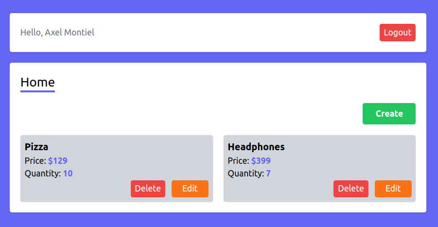
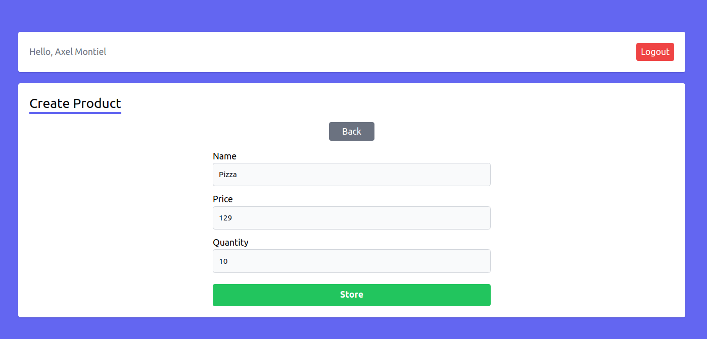
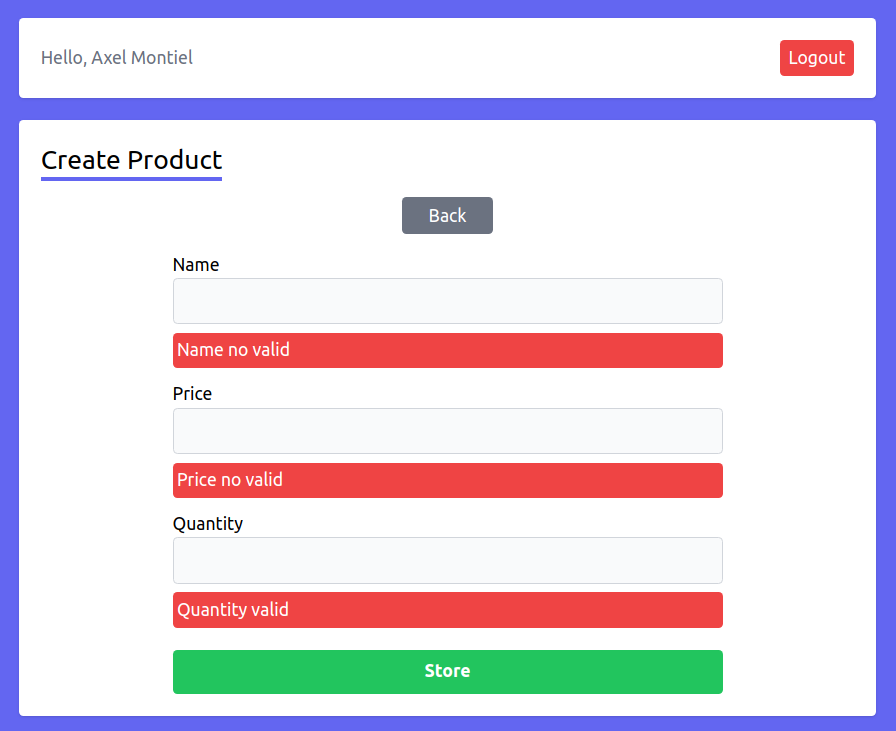
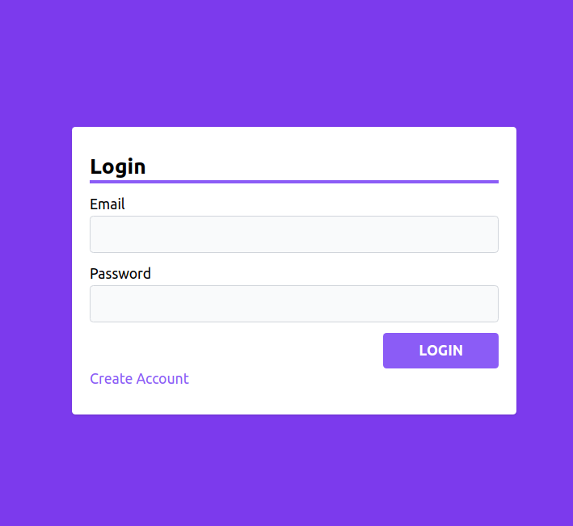
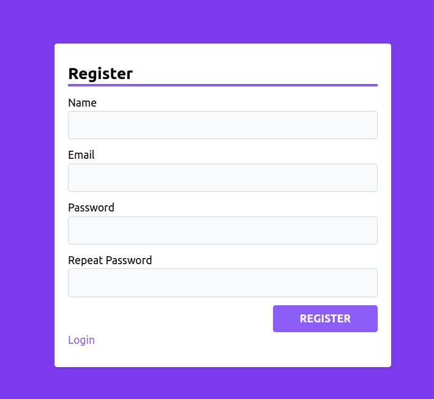
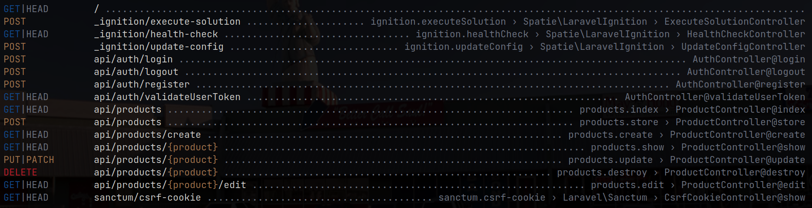

# api-auth-react-laravel

### Languages and Frameworks used.
|   |   |
|---|---|
|React|   
|Redux|   
|Javascript|   
|Laravel| 
|PHP| 
|Tailwind CSS| 

## Preview






## Laravel endpoints


## Requeriments
- MySQL
- PHP: v8.0.2
- PHP Composer
- Laravel 9
- React: v18.2
- Node (npm)

## Getting started

### Installation

1. Clone repository.
```
$ git clone https://github.com/Blairi/api-auth-react-laravel.git
```

2. Install PHP dependencies.
```
$ php composer install
```

3. Install Javascript dependencies.
```
$ npm install
```

### Configure development environment

1. Create MySQL database.

2. Create Laravel .env file in <b>api-auth-laravel</b>

3. Create Vite .env file in <b>api-auth-react</b>

## Quick start development server

1. Start PHP server
```
$ cd api-auth-laravel
$ php artisan serve
```

2. Start Node server
```
$ cd api-auth-react
$ npm run dev
```